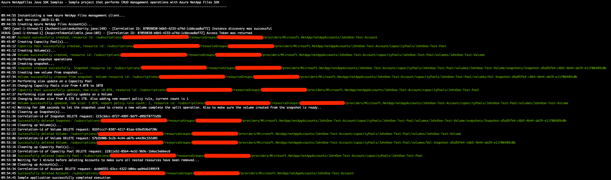

# Azure NetApp Files SDK for Java

This project demonstrates how to use a Java sample application to perform CRUD management operations for the Microsoft.NetApp
resource provider. 

In this sample application we perform the following operations:

* Creations
    * NetApp accounts
    * Capacity pools
    * Volumes
    * Snapshots
    * Volume from snapshot
* Updates
    * Change a capacity pool size from 4 TB to 10 TB
    * Change a volume size from 100 GB to 1 TB
    * Add a new NFS export policy to an existing volume
* Deletions
    * Snapshots
    * Volumes (including those created from snapshots)
    * Capacity pool
    * NetApp accounts

>Note: The cleanup execution is commented out by default. If you want to run this end-to-end with the cleanup, simply
>uncomment the related lines in main.java

Most of these operations are based on an asynchronous programming model to demonstrate how to asynchronously manage
Azure NetApp Files resources with Java. The exceptions are volume creation and deletion operations that are executed sequentially
at the Resource Provider level; therefore, these operations are executed sequentially.

If you don't already have a Microsoft Azure subscription, you can get a FREE trial account [here](http://go.microsoft.com/fwlink/?LinkId=330212).

## Prerequisites

1. This project is built upon Maven, which must be installed in order to run the sample. Instructions on installing Maven can be found on their website [here](https://maven.apache.org/install.html)
1. Azure subscription
1. Subscription needs to be whitelisted for Azure NetApp Files. For more information, see
[Submit a waitlist request for accessing the service](https://docs.microsoft.com/azure/azure-netapp-files/azure-netapp-files-register#waitlist).
1. Resource Group created
1. Virtual Network with a delegated subnet to Microsoft.Netapp/volumes resource. For more information, see 
[Guidelines for Azure NetApp Files network planning](https://docs.microsoft.com/en-us/azure/azure-netapp-files/azure-netapp-files-network-topologies). 
1. For this sample console application to work, authentication is needed. We will use Service Principal based authentication
    1. Within an [Azure Cloud Shell](https://docs.microsoft.com/en-us/azure/cloud-shell/quickstart) session, make sure
    you're logged in at the subscription where you want to be associated with the service principal by default:
        ```bash
        az account show
       ```
         If this is not the correct subscription, use:             
         ```bash
        az account set -s <subscription name or id>  
        ```
    1. Create a service principal using Azure CLI: 
        ```bash
        az ad sp create-for-rbac --sdk-auth
        ```
       
       >Note: This command will automatically assign RBAC contributor role to the service principal at subscription level.
       You can narrow down the scope to the specific resource group where your tests will create the resources.

    1. Copy the output contents and paste it in a file called azureauth.json, and secure it with file system permissions.
    1. Set an environment variable pointing to the file path you just created. Here is an example with Powershell and bash:
        
        Powershell
        ```powershell
        [Environment]::SetEnvironmentVariable("AZURE_AUTH_LOCATION", "C:\sdksample\azureauth.json", "User")
        ```
        Bash
        ```bash
        export AZURE_AUTH_LOCATION=/sdksamples/azureauth.json
        ```
    
## What does netappfiles-java-sdk-sample do?

Currently, Azure NetApp Files SDK exposes control plane management operations--CRUD operations--for its resources like NetApp accounts,
capacity pools, volumes, and snapshots. We start this execution by reading a configuration file (appsettings.json).
This file has two sections: the 'general' section has information about the subscription and resource group to be used.
The other section, 'accounts', is the place that defines the accounts, capacity pools, and volumes. This process will
create a configuration object that is used extensively throughout the code to reference the resources to be created,
updated, and deleted.

>Note: See [Resource limits for Azure NetApp Files](https://docs.microsoft.com/en-us/azure/azure-netapp-files/azure-netapp-files-resource-limits)
>to understand Azure NetApp Files limits.

The SDK will then move forward to the authentication process, generating a ServiceClientCredentials (service principal) that
is accepted by the AzureNetAppFilesManagementClient to create the management client, which is used to make the CRUD requests
and is also used extensively throughout the code.

Then the sample will start the CRUD operations by creating the accounts, capacity pools, and volumes, in this exact sequence
\(see [Azure NetApp Files storage hierarchy](https://docs.microsoft.com/en-us/azure/azure-netapp-files/azure-netapp-files-understand-storage-hierarchy)\).
Afterwards, a snapshot is created and following that, a new volume is created from that snapshot.
After all resources have been created, the sample will perform an update to a capacity pool by increasing its size and, then it will
perform updates to a volume by changing its size quota and adding an extra export policy.
Finally, the cleanup process starts and removes all resources deployed by this application (provided that the appropriate code in main.java has been uncommented).

>Note: This sample does not have a specific retrieve section, because we perform gets and lists operations in several
>places throughout the code.

## How the project is structured

The following table describes all files within this solution:

| Folder         | FileName                    | Description                                                                                                                                                                                                                                                               |
|----------------|-----------------------------|---------------------------------------------------------------------------------------------------------------------------------------------------------------------------------------------------------------------------------------------------------------------------|
| Root              | _sample_appsettings.json    | This is the sample appsettings.json file. To use it, make a copy and rename to 'appsettings.json'. Sizes are all defined in bytes. By default the appsettings.json is included in the .gitignore file to avoid unwanted extra information being committed to a public Git repo
| Root\\^           | main.java                   | Reads configuration, authenticates, executes all operations
| Root\\^           | Creation.java               | Class that contains all resource creation loops, following the hierarchy logic in order to successfully deploy Azure NetApp Files resources
| Root\\^           | Updates.java                | Class that is used to update capacity pool and volume sizes, and to add a new export policy to a Volume as well
| Root\\^           | Snapshots.java              | Class used for snapshot operations such as creating a new snapshot and creating a new volume from a snapshot
| Root\\^           | Cleanup.java                | Class that performs cleanup of all artifacts that were created during this sample application. Its call is commented out by default in main.java
| Root\\^\common    | CommonSdk.java              | Class dedicated to common operations related to Azure NetApp Files SDK
| Root\\^\common    | ProjectConfiguration.java   | Class used to create the configuration object based on appsettings.json file contents
| Root\\^\common    | ResourceUriUtils.java       | Class that exposes a few methods that help parsing Uri's, building new Uri's, or getting a resource name from a Uri, etc
| Root\\^\common    | ServiceCredentialsAuth.java | A small support class for extracting and creating credentials from a File
| Root\\^\common    | Utils.java                  | Class that exposes methods that help with getting the configuration object, byte conversion, etc
| Root\\^\model     | *                           | Various .java files that define objects received from the configuration file and are used throughout the code
>\\^ == src/main/java/sdk/sample

## How to run the console application

1. Clone the SDK sample locally
    ```powershell
    git clone https://github.com/Azure-Samples/netappfiles-java-sdk-sample
    ```
1. Change folder to **.\netappfiles-java-sdk-sample**
1. Make a copy of **_sample_appsettings.json** file, rename it to **appsettings.json** and modify its contents accordingly
(at minimum all values between **\<\>** must be replaced with real values).
1. Make sure you have the azureauth.json and its environment variable with the path to it defined (as previously described)
1. Compile the console application
    ```powershell
    mvn clean compile
    ```
1. Run the console application
    ```powershell
    mvn exec:java -Dexec.mainClass="sdk.sample.main"
    ```
   
Sample output


## References

* [Resource limits for Azure NetApp Files](https://docs.microsoft.com/azure/azure-netapp-files/azure-netapp-files-resource-limits)
* [Azure Cloud Shell](https://docs.microsoft.com/azure/cloud-shell/quickstart)
* [Azure NetApp Files documentation](https://docs.microsoft.com/azure/azure-netapp-files/)
* [Download Azure SDKs](https://azure.microsoft.com/downloads/)
